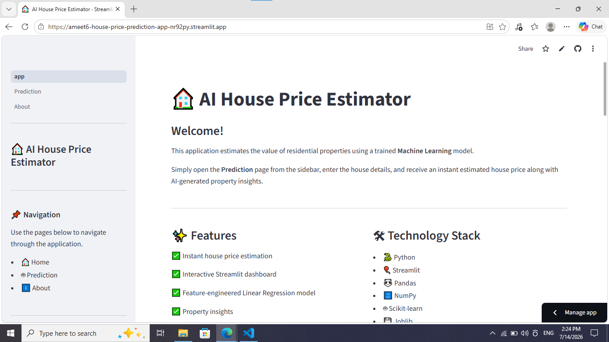
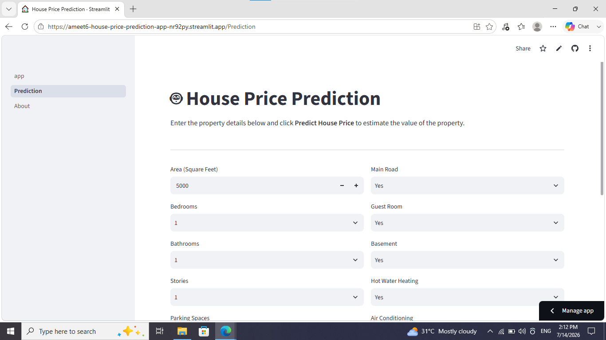
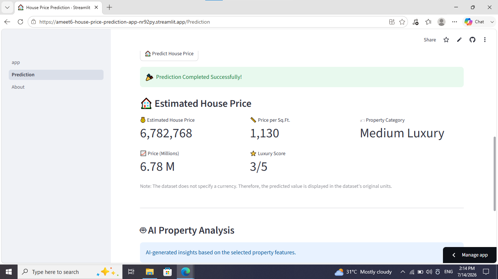
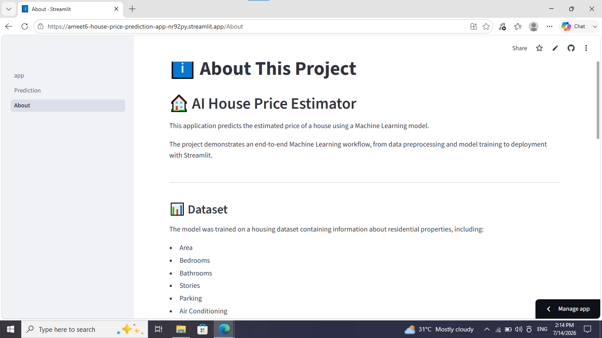

# 🏠 AI House Price Estimator

A Machine Learning web application that estimates house prices using property features such as area, bedrooms, bathrooms, parking, furnishing status, and other amenities.

The application is built with **Python**, **Scikit-learn**, and **Streamlit** to provide an interactive interface for instant house price estimation.

---

# 📌 Project Overview

This project demonstrates an end-to-end Machine Learning workflow including:

- Data preprocessing
- Exploratory Data Analysis (EDA)
- Feature Engineering
- Model Training
- Model Evaluation
- Model Deployment using Streamlit

The final model predicts the estimated value of a residential property based on user-provided inputs.

---

# ✨ Features

- 🏠 House Price Estimation
- 🤖 Linear Regression Model
- 📈 Price in Millions
- 📏 Price per Square Foot
- ⭐ Luxury Score
- 🏷 Property Category
- 🧠 AI Property Analysis
- 🎈 Interactive Streamlit Interface

---

# 🛠 Technologies Used

- Python
- Streamlit
- Pandas
- NumPy
- Scikit-learn
- Joblib
- Matplotlib
- Seaborn

---

# 📂 Project Structure

```text
House-Price-Prediction/
│
├── data/
├── model/
├── pages/
├── screenshots/
├── app.py
├── train.py
├── requirements.txt
├── README.md
└── House_Price_Prediction.ipynb

## 🚀 Live Demo

[text](https://ameet6-house-price-prediction-app-nr92py.streamlit.app/)

## 📷 Screenshots

### Home Page



### Prediction Page



### Prediction Result



### About Page

